### 商品详情页

<br/>

展示字段：productObj.activityHuodongmoshi（应用在两处）已对

数据来源：productsDetail()  定义在：@/api/brand

对应接口：商品详情

```javascript
`/api/commodity/product/productDetail/${obj.shopBizCode}/${obj.productNo}`
```

 <br/>

#### 第二处（已对）

涉及组件：activity 

展示字段：

数据来源：queryActivity()  定义在：@/api/dashboard

对应接口：查询单个活动

```javascript
`/api/commodity/subscribe/v2/queryActivity/${obj.shopBizCode}/${obj.activityNo}`
```

 <br/>

#### 第三处（已对）

涉及组件：'@/components/recommendProduct.vue'

展示字段：**（需添加字段）**

数据来源：getRecommendProduct()  定义在：@/api/brand

对应接口：商品推荐列表

```javascript
`/api/commodity/recommend/product/product/recommendation/${obj.shopId}/${obj.productNoStr}`
```

<br/>

### 首页 index （已对）

涉及组件：'@/components/activity.vue'

展示字段：crossBorderProduct

数据来源：queryActivityOfIndex()  定义在：@/api/dashboard

对应接口：首页活动列表

```javascript
`/api/commodity/subscribe/v2/queryPageForB/${
    obj.shopBizCode
  }/${obj.msOpenId || 1}`
```

<br/>

### 名厂优品 presale-factory（已对）

涉及组件：product

展示字段：productObj.activityHuodongmoshi

数据来源：getPresaleProductlist()  定义在：@/api/promition

对应接口：

```javascript
`/api/commodity/threeindustry/mingchang/productlist?shopBizCode=${params.shopBizCode}`,
```

<br/>

### 精选预告 forcast（已对）

涉及组件：'@/components/activity.vue'

展示字段：crossBorderProduct

数据来源：queryForcastActivity()  定义在：@/api/dashboard

对应接口：按分组查询预告活动

```javascript
`/api/commodity/subscribe/v2/queryPreActivity/${obj.shopBizCode}`
```

<br/>

### 新鲜直达 presale-fresh （已对）

涉及组件：'@/components/presale-fresh-item.vue'

展示字段：**（需添加字段）**

数据来源：getPresaleFreshProductlist()  定义在：@/api/promotion

对应接口：

```javascript
`/api/commodity/threeindustry/fresh/productlist?shopBizCode=${params.shopBizCode}`
```

### 优惠凑单 offer-order 、coupon-offer-list（似乎不涉及）

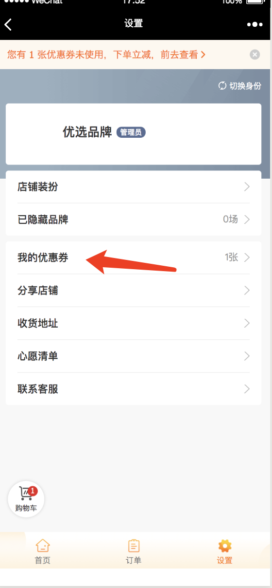

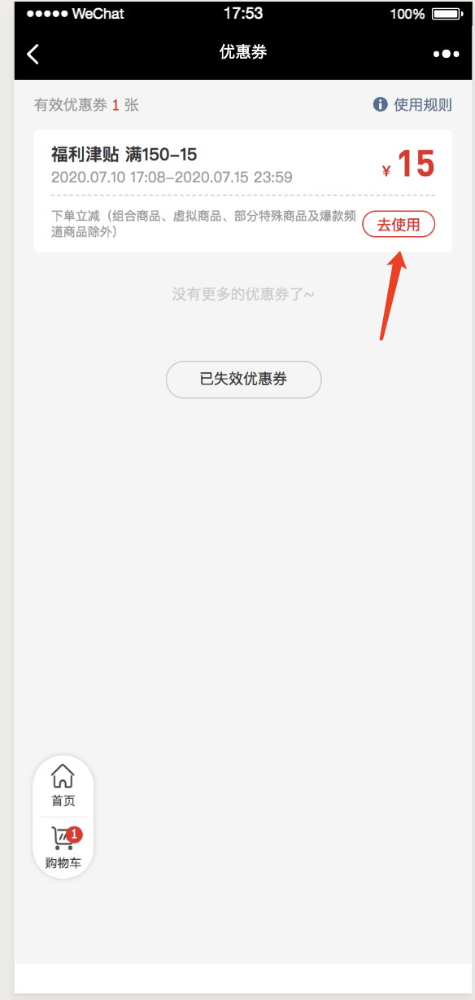

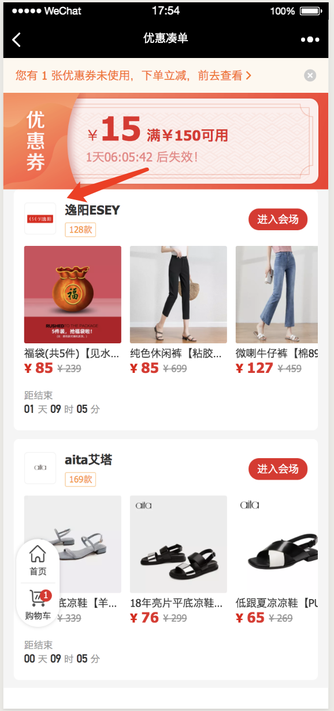

涉及组件：'@/components/activity.vue'

展示字段：

数据来源：getListByCoupon()  定义在：@/api/coupon

对应接口：根据优惠券查询订阅活动列表

```javascript
`/api/commodity/subscribe/v2/discountCoupon/queryPage/${params.shopBizCode}/${params.couponId}`
```

<br/>

### 品牌活动标签页 brand


#### 第一处 已对

展示字段：crossBorderProduct

数据来源：productList()  定义在：@/api/brand

对应接口：分类接口

```javascript
`/api/commodity/product/list/${obj.shopBizCode}/${obj.activityNo}?pageNum=${obj.params.pageNum}&pageSize=${obj.params.pageSize}`
```

#### 第二处 已对

涉及组件：`'@/components/product.vue'`

展示字段：productObj.activityHuodongmoshi

数据来源：productList()  定义在：@/api/brand

对应接口：分类接口

```javascript
`/api/commodity/product/list/${obj.shopBizCode}/${obj.activityNo}?pageNum=${obj.params.pageNum}&pageSize=${obj.params.pageSize}`
```

### 搜索页


#### 第一处（已对）

涉及组件：'@/components/recommendProductPosition.vue'——>'@/components/recommendProductCommonComponent.vue'

展示字段：未确定是否定义crossBorderProduct

数据来源：queryRecommendation()  定义在：@/api/promotion

对应接口：商品推荐(用户)

```javascript
`/api/commodity/recommend/product/product/recommendation/user/${obj.shopId}`
```

### 搜索结果页


#### 第一处（已对）

涉及组件：'@/components/product.vue'

展示字段：

数据来源：filterSearch()  定义在：@/api/search

对应接口：搜索商品

```javascript
`/api/commodity/product/search/sort/filter/${obj.shopId}`
```

<br/>

#### 第二处 没有商品时（已对）

涉及组件：'@/components/activity.vue'

展示字段：

数据来源：filterSearch()  定义在：@/api/search

对应接口：搜索商品

```javascript
`/api/commodity/product/search/sort/filter/${obj.shopId}`
```

### 搜索结果品牌（已对）

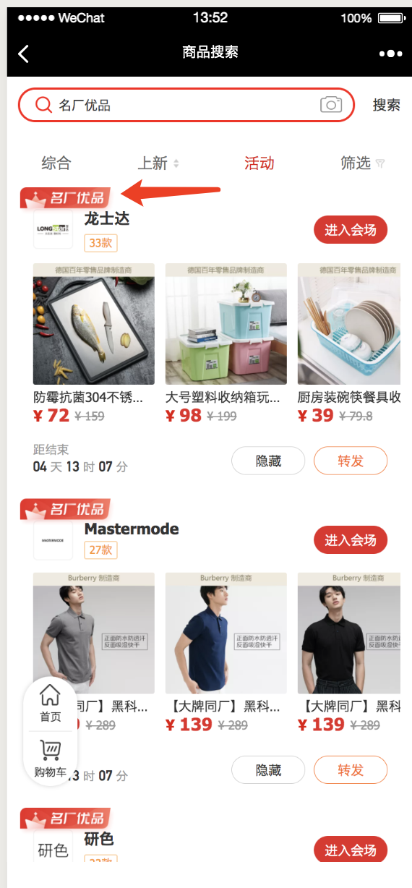

涉及组件：'@/components/activity.vue'

展示字段：activityObj.huodongmoshi

数据来源：filterSearch()  定义在：@/api/search

对应接口：搜索商品传活动

```javascript
`/api/commodity/product/search/sort/filter/${obj.shopId}`
```

### 购物车（已对）

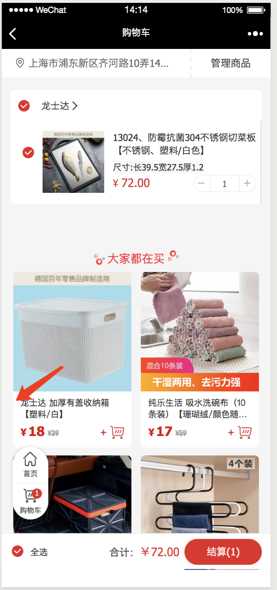

涉及组件：'@/components/recommendProductPosition.vue'——>'@/components/recommendProductCommonComponent.vue'

展示字段：未确定是否定义crossBorderProduct

数据来源：getRecommendProduct()  定义在：@/api/brand

对应接口：商品推荐列表

```javascript
`/api/commodity/recommend/product/product/recommendation/${obj.shopId}/${obj.productNoStr}`
```

### 品牌活动列表（删除）

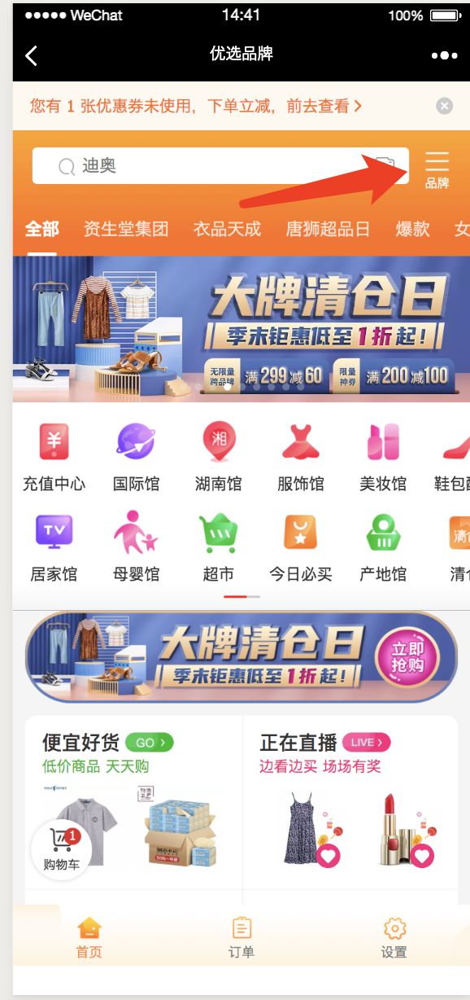


展示字段：未确定是否定义

数据来源：querybrandList()  定义在：@/api/ dashboard

对应接口：查询类目对应商品列表

```javascript
'/api/commodity/subscribe/v2/querybrandList'
```

### C-订单列表

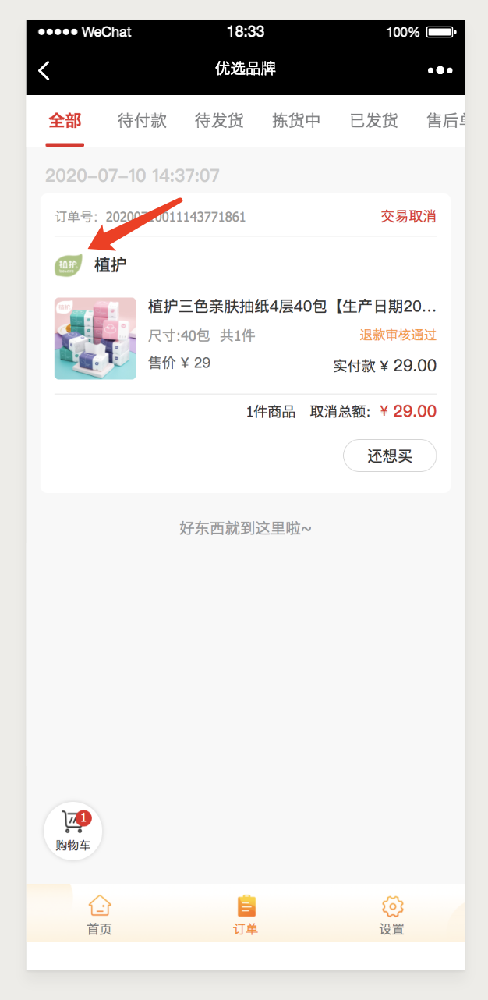

#### 第一处（已对）

展示字段：类似crossBorderProduct

数据来源：orderList()  定义在：@/api/ order

对应接口：订单列表

```javascript
'/api/order/list'
```


#### 第二处 待付款（已对）

展示字段：类似crossBorderProduct

数据来源：pendingPaymentOrders()  定义在：@/api/ order

对应接口：订单列表

```javascript
`/api/order/pendingPaymentOrders`
```

<br/>

### C-订单详情（已对）

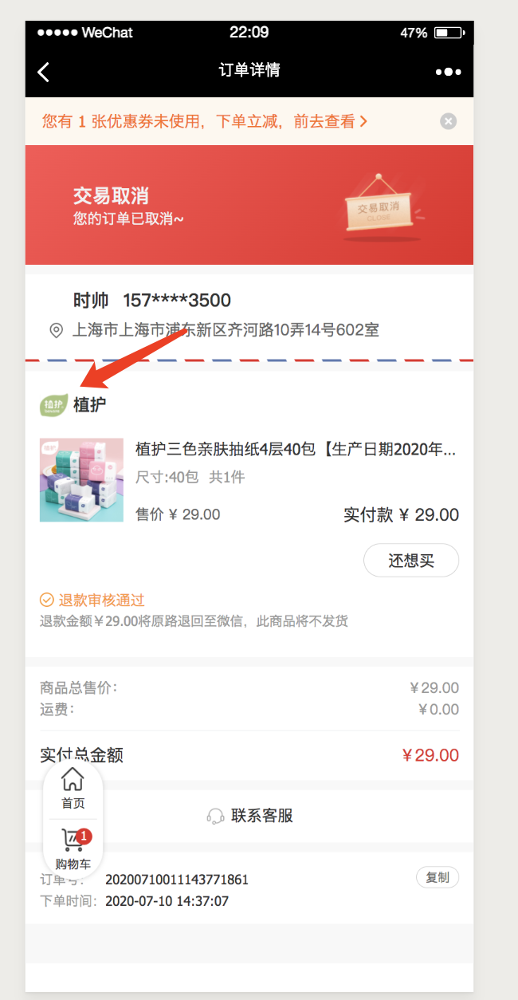

展示字段：未定义

数据来源：orderInfo()  定义在：@/api/ order

对应接口：订单详情

```javascript
`/api/order/info?shopBizCode=${obj.shopBizCode}`
```

### 确认订单

#### 不是从购物车来的（已对）

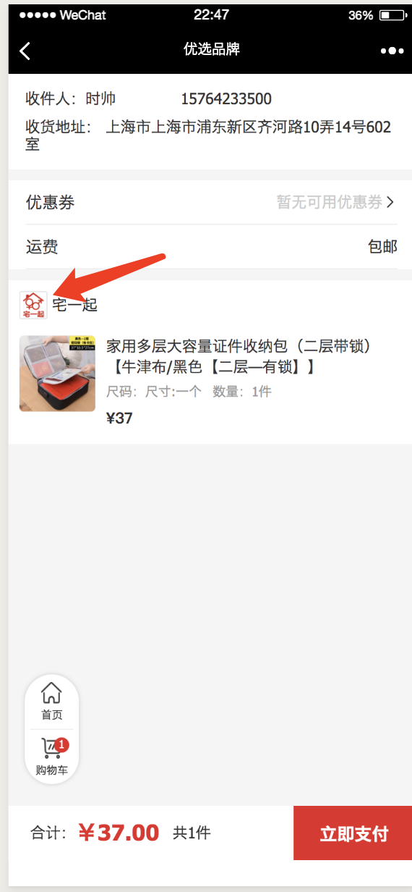

涉及组件：'./componnets/orderCardProduct.vue'——>'./ActivityTitle.vue'

展示字段：类似isCrossBorder

数据来源：queryBySkuNo()  定义在：@/api/brand

对应接口：查询单个sku商品信息

```javascript
`/api/commodity/sku/queryBySkuNo`
```

#### 从购物车来的（已对）

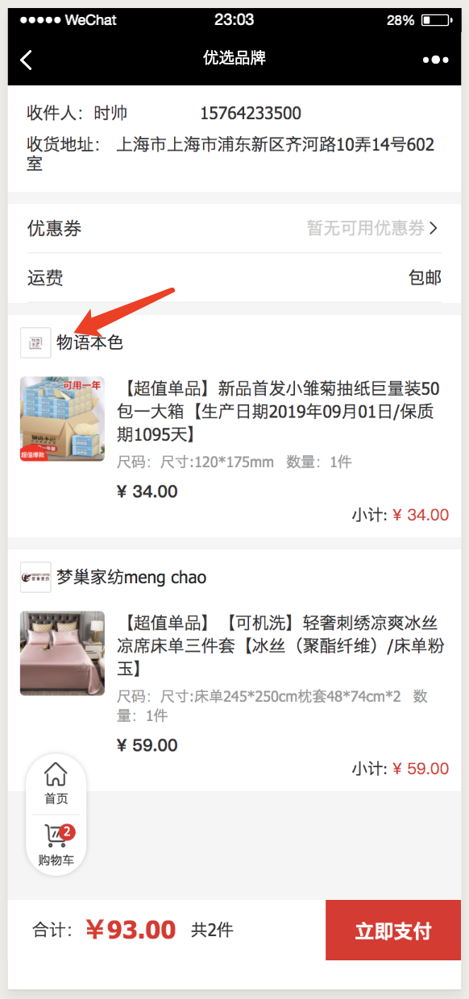

涉及组件：'./componnets/orderCardCart.vue'——>'./ActivityTitle.vue'

展示字段：类似isCrossBorder

数据来源：validateCartSKU()  定义在：@/api/cart

对应接口：

```javascript
'/api/shoppingCart/checkCartList'
```

### 转发品牌（已对）

数据来源：queryActivityShare()  定义在：@/api/share

对应接口：活动分享

```javascript
'/api/member/activity/share/${query.shopId}/${query.activityNo}'
```

### 转发单品（已对）

数据来源：queryProductShare()  定义在：@/api/share

对应接口：商品分享

```javascript
'/api/member/product/share/${query.shopId}/${query.productId}/${query.activityNo}'
```

<br/>

### 我的推广订单列表（已对）

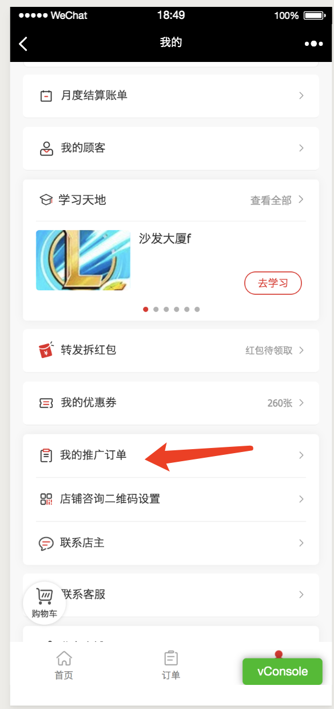

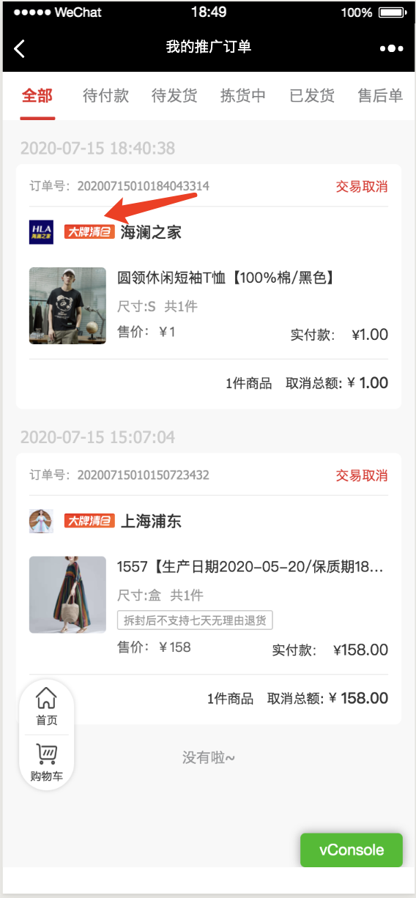

涉及组件：'./orderCard.vue';

展示字段：类似crossBorderProduct

数据来源：distributorOrderList()  定义在：@/api/order

对应接口：我的推广订单

```javascript
'/api/order/distributor/listByPage'
```

<br/>

### 我的推广订单详情页（已对）

展示字段：类似crossBorderProduct

数据来源：distributorOrderDeatil()  定义在：@/api/order

对应接口：我的推广订单详情

```javascript
'/api/order/distributor/detail'
```

<br/>

### 饷店订单列表

涉及两个组件

展示字段：类似crossBorderProduct

数据来源：$shop.orderList()  定义在：@/api/shop/urls

对应接口：订单列表

```javascript
'/api/smallShop/order/orderList'
```

<br/>

### 饷店订单详情

展示字段：类似crossBorderProduct

数据来源：$shop.orderDetail()  定义在：@/api/shop/urls

对应接口：订单详情

```javascript
'/api/smallShop/order/orderDetail'
```

### 